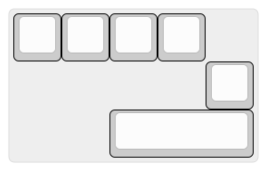
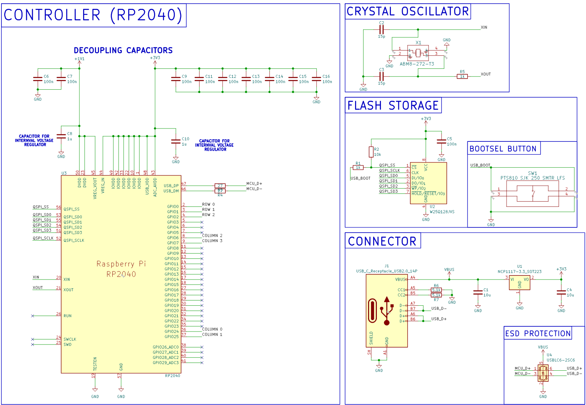
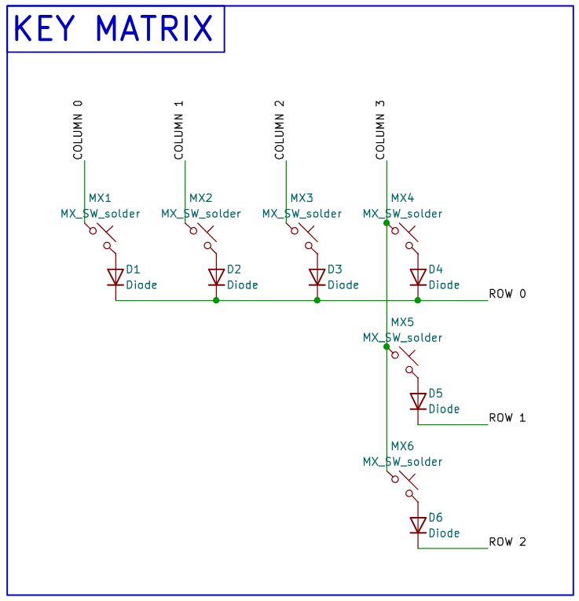
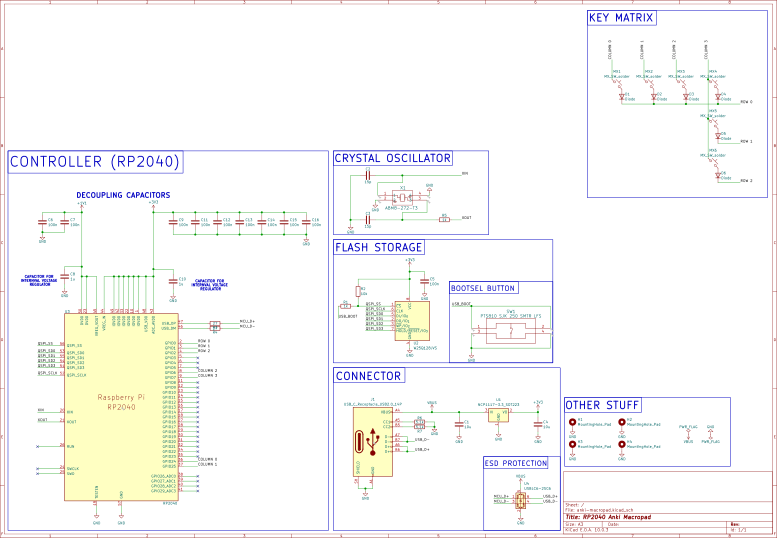
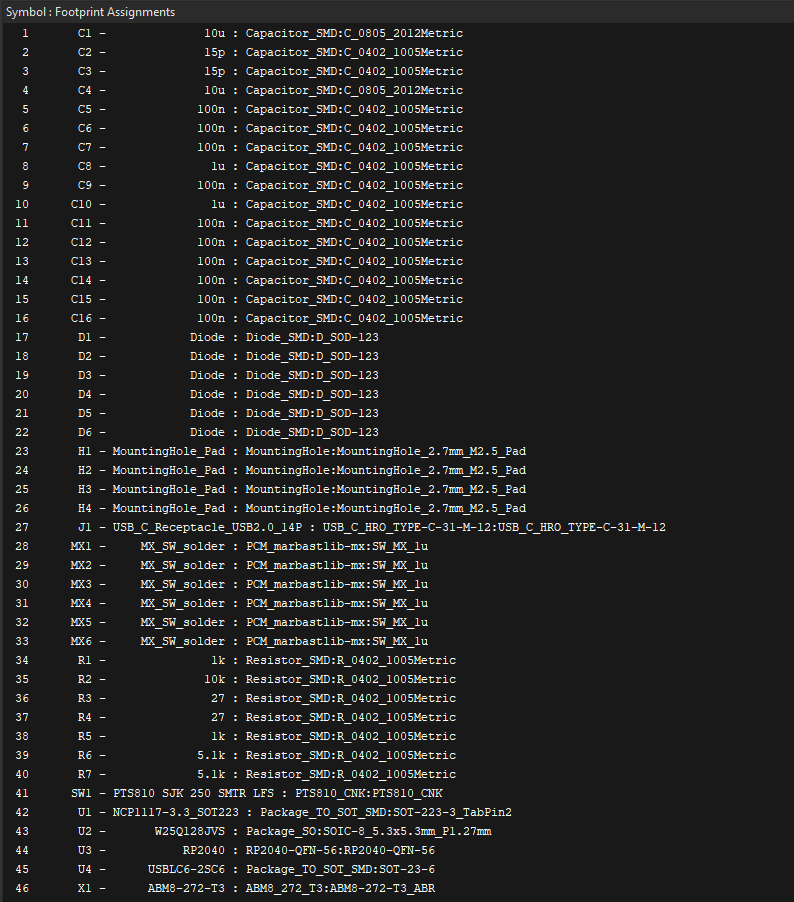
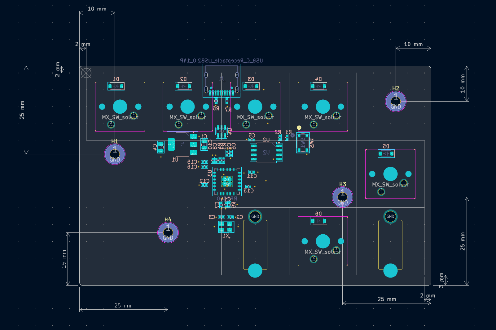
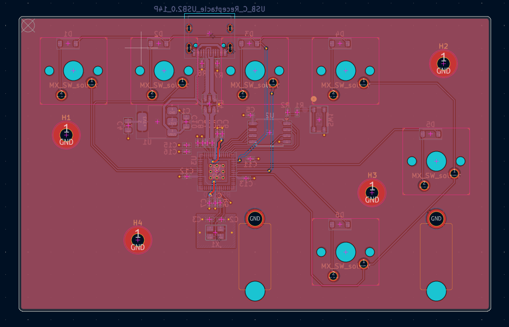
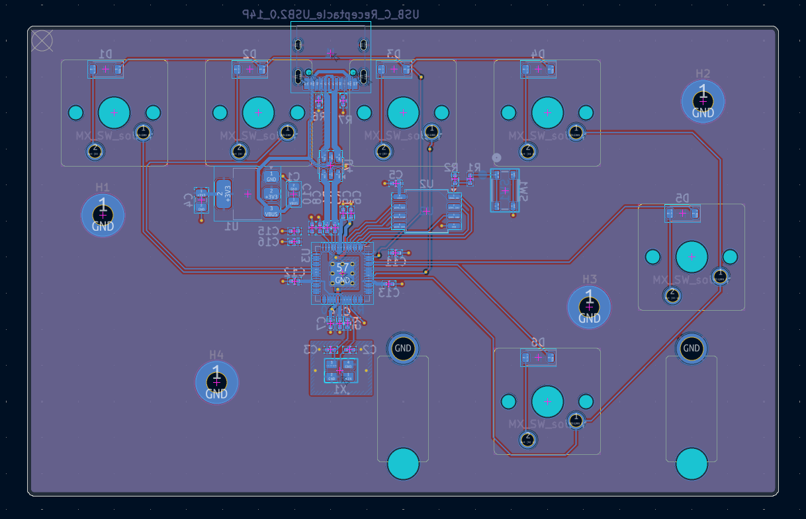

# Anki Macropad

A custom 6-key macropad designed for use with [Anki](https://apps.ankiweb.net/), a spaced repetition flashcard application. The macropad features an RP2040 microcontroller directly on the PCB, a custom case, and QMK firmware.

---

## Table of Contents

* [Overview](#overview)
* [Planning](#planning)
* [Layout Design](#layout-design)
* [PCB Design](#pcb-design)
* [Firmware](#firmware)

---

## Overview

Rather than using a pre-built microcontroller board such as a Raspberry Pi Pico, this macropad integrates an RP2040 MCU directly onto a custom PCB. This approach allows full control over board dimensions, USB port placement, and component layout — and presents a more complete hardware design challenge.

The macropad is designed around the Anki study workflow: rating flashcards (Again / Hard / Good / Easy), flipping cards to reveal the answer, and editing cards on the fly.

**Tools used:** KiCad (schematic & PCB), SolidWorks (case), QMK MSYS (firmware), JLCPCB (PCB fabrication)

---

## Planning

### Process

The overall project plan was structured as follows:

1. **Preparation** — collect resources, create GitHub repository, research PCB design
2. **Layout design** — identify macropad goals, design key layout
3. **PCB design** — schematic, footprint assignment, PCB layout, trace routing, DRC, export production files
4. **Order PCB** from JLCPCB
5. **Case design** — generate plate, design top and bottom case in SolidWorks, 3D print
6. **Firmware** — configure QMK, flash firmware
7. **Assembly** — solder switches, assemble PCB with case

### Major Resources

|Resource|Description|
|-|-|
|[Hardware Design with RP2040](https://pip-assets.raspberrypi.com/categories/814-rp2040/documents/RP-008279-DS-1-hardware-design-with-rp2040.pdf)|Official Raspberry Pi documentation covering hardware design requirements for the RP2040 on a custom PCB, including a minimal design example.|
|[Joe Scotto — PCB Design Playlist](https://www.youtube.com/playlist?list=PLBD2IS_t_iWZDMdG_ZF57x9Ebm3kxKqxF) and [GitHub Library](https://github.com/joe-scotto/scottokeebs/tree/main)|Videos covering mechanical keyboard PCB design in KiCad, including designs using an STM32 MCU directly on a PCB. Used for understanding KiCad workflow and as a reference for footprints.|
|[Mechanical Keyboard PCB Design Guide — PCBSync](https://pcbsync.com/mechanical-keyboard-pcb-design/)|Broad overview of the keyboard PCB design process, covering matrix design, schematic structure, and routing guidelines.|
|[Hardware Design with RP2040 — DigiKey YouTube](https://www.youtube.com/watch?v=kcwvuwetgEQ&t=7s)|Video covering key aspects of designing, fabricating, and testing a custom PCB with an RP2040.|
|[QMK Firmware Documentation](https://docs.qmk.fm/)|Official documentation for QMK firmware used to configure and build the keyboard firmware.|

---

## Layout Design

### Goals

The macropad is designed around the core Anki study workflow:

* **Rate a card:** Again (1), Hard (2), Good (3), Easy (4)
* **Flip a card:** Spacebar
* **Edit a card:** E

After testing different configurations on a standard keyboard, the following layout was chosen. The four rating keys are in the top row. A wide 3U key on the bottom acts as the spacebar/flip key, and the edit key sits to the right as a thumb key.

---

## PCB Design

### Why RP2040

The RP2040 was chosen as the MCU for two main reasons:

1. **Design flexibility** — placing the microcontroller directly on the PCB means the USB port can be positioned freely and no bulky external microcontroller board is required, allowing a more compact and clean design.
2. **Challenge** — designing the supporting hardware around the RP2040 from scratch is a more complete engineering exercise than simply plugging in a Pico.

### Hardware Components

The following components were selected to support the RP2040, largely following the minimal design example in the official hardware documentation.

**Power**

|Component|Quantity|Use|
|-|-|-|
|USB-C Receptacle (USB2.0, 14P)|1|5V input power via VBUS|
|5.1kΩ pull-down resistors (CC1/CC2)|2|Signal to USB-C power source that a device is connected|
|NCP1117-3.3 LDO (SOT-223)|1|Convert 5V to 3.3V|
|10µF capacitors (0805)|2|Input and output decoupling for LDO|
|USBLC6-2SC6 ESD protection (SOT-23-6)|1|Protect against ESD on USB lines|
|100nF decoupling capacitors (0402)|9|Filter power supply noise for RP2040 power pins|
|1µF capacitors (0402)|2|Stabilize internal 1.1V voltage regulator (VREG_IN and VREG_OUT)|

**Flash Storage**

|Component|Quantity|Use|
|-|-|-|
|W25Q128JVS QSPI Flash (SOIC-8)|1|Store program code for RP2040 to boot from|
|100nF capacitor (0402)|1|Decoupling for flash VCC|
|PTS810 SJK 250 SMTR LFS tactile button|1|BOOTSEL button — hold while powering on to enter USB bootloader mode|
|1kΩ resistor (0402)|1|Series resistor on QSPI_SS for BOOTSEL circuit|
|10kΩ resistor (0402)|1|Pull-up resistor for BOOTSEL circuit|

**Crystal Oscillator**

|Component|Quantity|Use|
|-|-|-|
|ABM8-272-T3 12MHz crystal|1|Stable external clock source|
|15pF load capacitors (0402)|2|Provide the 10pF effective load capacitance required by the crystal|
|1kΩ series resistor on XOUT (0402)|1|Prevents crystal overdrive at 3.3V IOVDD|

**USB I/O**

|Component|Quantity|Use|
|-|-|-|
|27Ω series resistors (0402)|2|USB impedance matching on USB_DP and USB_DM|

**Key Matrix**

|Component|Quantity|Use|
|-|-|-|
|MX-compatible key switches|6|Input keys|
|1N4148W diodes (SOD-123)|6|Anti-ghosting, enables N-key rollover|

### Schematic Design

#### RP2040 Hardware

The RP2040 schematic is divided into four sections:

* **Controller** — RP2040 MCU, decoupling capacitors, internal voltage regulator capacitors, USB series termination resistors
* **Crystal Oscillator** — 12MHz crystal with load capacitors and XOUT series resistor
* **Flash Storage** — W25Q128JVS QSPI flash with decoupling cap and BOOTSEL button circuit
* **Connector** — USB-C connector, NCP1117 LDO voltage regulator, ESD protection (USBLC6-2SC6)

The ESD protection component was added based on the recommendation of the PCBSync guide and was not present in the minimal design example.

#### Keyboard Matrix

A 3-row × 4-column matrix is used, even though the macropad only has 6 keys. Using a matrix (rather than one GPIO per switch) is standard practice and allows diodes to be included. The diodes solve the ghosting problem — without them, pressing three keys in an L-shaped pattern can falsely register the fourth corner key. The diodes enforce one-way current flow, which also enables N-key rollover.

GPIO assignments:

* **Rows:** GPIO0 (Row 0), GPIO1 (Row 1), GPIO2 (Row 2)
* **Columns:** GPIO24 (Col 0), GPIO25 (Col 1), GPIO6 (Col 2), GPIO7 (Col 3)

#### Full Schematic

The two modules above are combined on a single schematic sheet, along with mounting holes and power flags for VBUS and GND. GPIO row and column pin assignments were chosen based on the RP2040 footprint to minimise routing difficulty on the PCB layout.

### Footprint Assignment

Footprints for most components came from KiCad's built-in libraries. The following exceptions were used:

* **USB-C connector** — footprint from Joe Scotto's repository
* **Key switches** — footprint from the [marbastlib](https://github.com/ebastler/marbastlib) KiCad keyboard library
* **Matrix diodes** — SOD-123 footprint from Joe Scotto's repository
* **Resistors and capacitors** — 0402 footprints, same as used in the minimal design example

### Board Configuration

The board was configured in KiCad's Board Setup to match JLCPCB's manufacturing capabilities.

JLCPCB Manufacturing Capabilities (click to expand)

**PCB Specifications**

* Layer count: 2
* Material: FR-4, dielectric constant 4.5
* Thickness: 1.6mm
* Copper weight: 1 oz
* Surface finish: Leaded HASL

**Drilling**

* Drill diameter: 0.15–6.3mm
* Min via hole / diameter: 0.15mm / 0.25mm
* Via hole-to-hole spacing: 0.2mm

**Traces**

* Min track width / spacing (1 oz): 0.10 / 0.10mm
* PTH annular ring: ≥0.25mm
* Pad to track clearance: 0.1mm

**Soldermask**

* Expansion: 1:1
* Bridge: 0.10mm

**Silkscreen**

* Minimum line width: 0.15mm
* Minimum text height: 1.0mm

**KiCad Board Setup**

|Parameter|Value|Justification|
|-|-|-|
|Copper layers|2|Sufficient for this design; cheapest option|
|Board thickness|1.6mm|Standard|
|Copper finish|HAL SnPb|Standard, cheap|
|Solder mask expansion|0mm|JLCPCB 1:1 expansion|
|Solder mask min web width|0.10mm|JLCPCB spec|
|Minimum clearance|0.10mm|JLCPCB minimum|
|Minimum track width|0.10mm|JLCPCB minimum|
|Minimum annular width|0.25mm|JLCPCB PTH annular ring spec|
|Copper to hole clearance|0.25mm|Matches minimal design example|
|Copper to edge clearance|0.5mm|Matches Joe Scotto template|
|Minimum drill size|0.15mm|JLCPCB minimum|
|Hole to hole clearance|0.20mm|JLCPCB spec|
|Minimum text height|1.0mm|JLCPCB spec|
|Minimum text thickness|0.15mm|JLCPCB spec|

**Net Classes**

|Name|Clearance|Track Width|Via Size|Via Hole|DP Width|DP Gap|
|-|-|-|-|-|-|-|
|Default|0.15mm|0.2mm|0.45mm|0.3mm|0.2mm|0.25mm|
|Power|0.2mm|0.4mm|0.45mm|0.3mm|0.2mm|0.25mm|
|USB Data|0.2mm|0.2mm|0.45mm|0.3mm|0.8mm|0.16mm|

Via sizes were chosen to maintain a 0.25mm annular ring (JLCPCB minimum): annular ring = (via diameter − hole diameter) / 2 = (0.45 − 0.3) / 2 = 0.075mm... actually 0.75mm via size with 0.25mm drill was the final choice.

The USB Data differential pair width (0.8mm) and gap (0.16mm) were calculated using the KiCad PCB Calculator transmission lines tool to achieve the 90Ω characteristic impedance required by the USB specification, using the JLCPCB 1.6mm FR4 stackup parameters (Er = 4.5, copper thickness = 0.035mm).

### PCB Layout

The RP2040 and all its supporting components are placed on the back of the board. The switches are on the front, with their diodes adjacent on the back. This keeps the front of the board clean and follows the recommendations in the hardware documentation.

Key layout decisions:

* Decoupling capacitors placed as close as possible to the RP2040's power pins
* 1µF VREG capacitors (C8, C10) placed directly next to VREG_IN (pin 45) and VREG_OUT (pin 44)
* QSPI flash connected to the RP2040 with short, direct traces
* R1 and R2 (BOOTSEL resistors) placed close to the flash chip
* USB series termination resistors (R3, R4) placed close to the RP2040's USB pins

### Trace Routing

Routing was done almost entirely on the back copper layer, where the components are located. Filled copper zones were used for power distribution:

* **Front (F.Cu):** Full-board ground fill
* **Back (B.Cu):** +3V3 fill covering most of the board; smaller +1V1 fill under the RP2040; three local ground fills

For the USB data lines, a solid ground fill is placed directly below the traces for the full length of the track, as required by the hardware documentation for the transmission lines to function correctly. Crystal traces were kept short and routed directly to the MCU pins.

### Manufacturing

The board was ordered from JLCPCB with SMT assembly (PCBA) for all surface-mount components except the MX switches, which were soldered by hand after the boards arrived. The minimum order was 5 PCBs.

---

## Firmware

The firmware is built using [QMK](https://qmk.fm/). See [`firmware/README.md`](firmware/README.md) for build and flash instructions.

The keymap assigns the following keys:

|Physical Key|Keycode|Anki Function|
|-|-|-|
|Again|`1`|Rate card: Again|
|Hard|`2`|Rate card: Hard|
|Good|`3`|Rate card: Good|
|Easy|`4`|Rate card: Easy|
|Edit|`E`|Edit current card|
|Show Answer|`Space`|Flip card / show answer|

